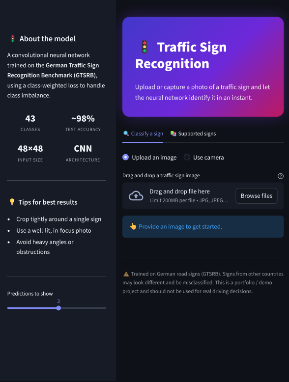
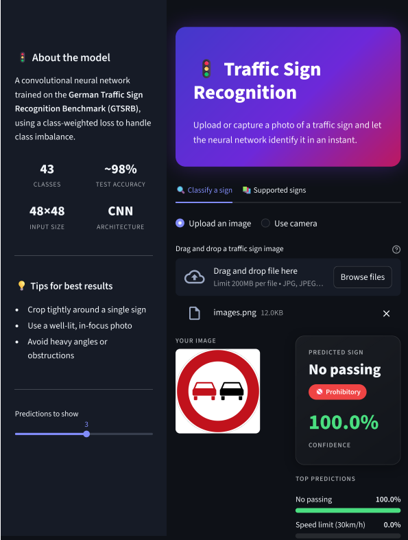
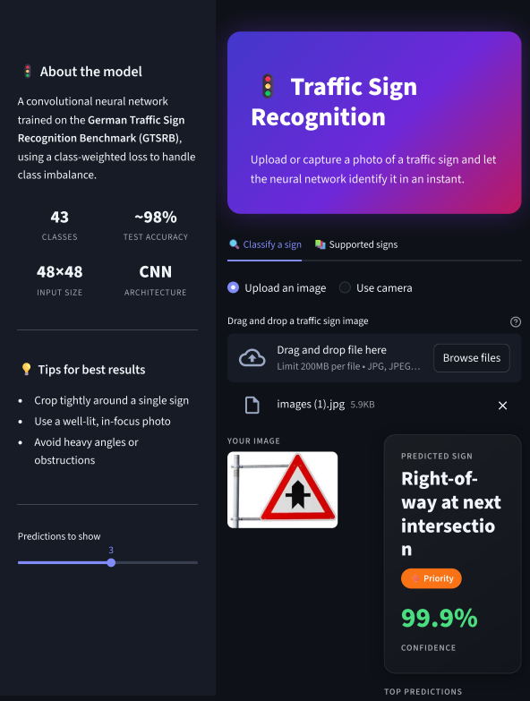

\# 🚦 Traffic Sign Recognition Using Deep Learning


A deep learning-based traffic sign classification project using a \*\*Convolutional Neural Network (CNN)\*\* trained on the \*\*German Traffic Sign Recognition Benchmark (GTSRB)\*\* dataset.


The trained model is integrated into an interactive \*\*Streamlit web application\*\* that allows users to upload a traffic sign image and receive the predicted traffic sign class along with confidence scores and the top three predictions.


\## 📌 Project Overview


Traffic sign recognition is an important computer vision task used in intelligent transportation systems and autonomous driving applications.


In this project, a CNN model was developed to classify traffic sign images into \*\*43 different categories\*\*.


The project includes the complete workflow from dataset exploration and preprocessing to model training, evaluation, and deployment through Streamlit.


\### Project Workflow


\*\*Dataset → Exploratory Analysis → Image Preprocessing → Data Augmentation → CNN Training → Evaluation → Streamlit Deployment\*\*


\---


\## ✨ Key Features


\* 🚦 Classification of \*\*43 traffic sign categories\*\*

\* 🧠 Custom CNN architecture using TensorFlow/Keras

\* 🖼️ Image preprocessing and resizing to \*\*48 × 48 pixels\*\*

\* 🔄 Data augmentation using rotation, zoom, brightness, and contrast

\* ⚖️ Class weighting to address dataset imbalance

\* 📊 Training and validation performance analysis

\* 🧪 Test-set evaluation

\* 📋 Classification report

\* 🔲 Confusion matrix analysis

\* 🔝 Top 3 prediction results in the Streamlit application

\* 📈 Prediction confidence scores

\* ⚡ Interactive Streamlit interface


\---


\## 📊 Dataset


The project uses the \*\*German Traffic Sign Recognition Benchmark (GTSRB)\*\* dataset.


The dataset contains images belonging to \*\*43 traffic sign classes\*\* and has an imbalanced distribution across classes.


During exploratory data analysis, the number of training images per class was examined to identify the imbalance between frequently occurring and rare traffic sign categories.


\### Dataset Processing


\* Images are converted to RGB format.

\* Images are resized to \*\*48 × 48 pixels\*\*.

\* Pixel values are normalized to the range \*\*0–1\*\*.

\* The dataset is divided into training, validation, and test sets.

\* A \*\*stratified split\*\* is used for the training/validation division so that the class distribution is better preserved.


\---


\## 🧠 CNN Architecture


The model is a custom Convolutional Neural Network built using TensorFlow/Keras.


\### Architecture


```text

Input Image

48 × 48 × 3

&#x20;     ↓

Data Augmentation

&#x20;     ↓

Conv2D (32 filters)

&#x20;     ↓

Batch Normalization

&#x20;     ↓

Max Pooling

&#x20;     ↓

Conv2D (64 filters)

&#x20;     ↓

Batch Normalization

&#x20;     ↓

Max Pooling

&#x20;     ↓

Conv2D (128 filters)

&#x20;     ↓

Batch Normalization

&#x20;     ↓

Max Pooling

&#x20;     ↓

Flatten

&#x20;     ↓

Dense (256 neurons)

&#x20;     ↓

Dropout (0.4)

&#x20;     ↓

Dense (43 classes)

&#x20;     ↓

Softmax

```


\### Model Configuration


| Component         | Details                          |

| ----------------- | -------------------------------- |

| Task              | Multi-class Image Classification |

| Model             | Convolutional Neural Network     |

| Dataset           | GTSRB                            |

| Number of Classes | 43                               |

| Input Size        | 48 × 48 × 3                      |

| Optimizer         | Adam                             |

| Loss Function     | Sparse Categorical Crossentropy  |

| Output Activation | Softmax                          |

| Dropout           | 0.4                              |


\---


\## 🔄 Data Augmentation


To improve model generalization, the training pipeline includes several augmentation techniques:


\* Random rotation

\* Random zoom

\* Random brightness

\* Random contrast


These transformations help the model handle variations in traffic sign images.


\---


\## ⚖️ Handling Class Imbalance


The GTSRB training dataset contains different numbers of images across the 43 classes.


To reduce the effect of class imbalance, \*\*balanced class weights\*\* were calculated using `compute\_class\_weight` from Scikit-learn.


These weights were passed to the model during training so that underrepresented classes receive greater importance during optimization.


\---


\## 🏋️ Model Training


The model was trained using:


\* \*\*25 maximum epochs\*\*

\* \*\*Batch size:\*\* 64

\* \*\*Optimizer:\*\* Adam

\* \*\*Early Stopping\*\*

\* \*\*ReduceLROnPlateau\*\*

\* \*\*Class weights\*\*


Early stopping was configured to restore the best model weights based on validation loss.


A learning-rate reduction strategy was also used when validation performance stopped improving.


\---


\## 📈 Model Evaluation


The trained model was evaluated using the held-out test dataset.


The evaluation includes:


\### Accuracy


Overall classification accuracy is calculated on the test set.


\### Classification Report


Precision, recall, and F1-score are calculated for each traffic sign class.


\### Confusion Matrix


A 43 × 43 confusion matrix is generated to examine which traffic sign classes are correctly classified and which classes are commonly confused.


\### Error Analysis


Misclassified test images are also examined to understand examples where the model predicts an incorrect traffic sign class.


> \*\*Test accuracy:\*\* Add the actual test accuracy from the notebook here once confirmed.


\---


\## 🖥️ Streamlit Application


The trained CNN model is deployed through a Streamlit web application.


Users can:


1\. Upload a traffic sign image.

2\. Preview the uploaded image.

3\. Run the trained CNN model.

4\. View the predicted traffic sign.

5\. View prediction confidence.

6\. View the top three predictions.


The application uses the saved `gtsrb\_model.keras` model for inference.


## 📸 Application Preview

### Traffic Sign Recognition Interface



### Prediction Result



### Another Prediction




\---


\## 🛠️ Technologies Used


\* \*\*Python\*\*

\* \*\*TensorFlow / Keras\*\*

\* \*\*NumPy\*\*

\* \*\*Pandas\*\*

\* \*\*Pillow\*\*

\* \*\*Scikit-learn\*\*

\* \*\*Matplotlib\*\*

\* \*\*Seaborn\*\*

\* \*\*Streamlit\*\*

\* \*\*Jupyter Notebook\*\*


\---


\## 📁 Project Structure


```text

traffic-sign-recognition-cnn/

│

├── .streamlit/

│   └── config.toml

│

├── app.py

├── gtsrb\_model.keras

├── gtsrb\_traffic\_sign\_cnn.ipynb

├── requirements.txt

├── traffic\_sign\_recognition.pptx

├── README.md

└── .gitignore

```


\---


\## 🚀 Run the Application Locally


\### 1. Clone the repository


```bash

git clone https://github.com/janushreesurendran/traffic-sign-recognition-cnn.git

```


\### 2. Navigate to the project directory


```bash

cd traffic-sign-recognition-cnn

```


\### 3. Install the dependencies


```bash

pip install -r requirements.txt

```


\### 4. Run the Streamlit application


```bash

streamlit run app.py

```


The application will open in your browser.


\---


\## 🔍 Prediction Pipeline


The application follows this prediction pipeline:


```text

Uploaded Image

&#x20;     ↓

RGB Conversion

&#x20;     ↓

Resize to 48 × 48

&#x20;     ↓

Normalize Pixel Values

&#x20;     ↓

CNN Model

&#x20;     ↓

Softmax Probabilities

&#x20;     ↓

Top Predictions

&#x20;     ↓

Traffic Sign + Confidence

```


\---


\## 📚 Project Files


| File                            | Description                                            |

| ------------------------------- | ------------------------------------------------------ |

| `app.py`                        | Streamlit application                                  |

| `gtsrb\_model.keras`             | Trained CNN model                                      |

| `gtsrb\_traffic\_sign\_cnn.ipynb`  | Data analysis, preprocessing, training, and evaluation |

| `requirements.txt`              | Python dependencies                                    |

| `traffic\_sign\_recognition.pptx` | Project presentation                                   |

| `.streamlit/`                   | Streamlit configuration                                |

| `.gitignore`                    | Files excluded from Git tracking                       |


\---


\## 🎯 What I Worked On


This project provided hands-on experience with:


\* Computer vision and image classification

\* CNN architecture design

\* Image preprocessing

\* Data augmentation

\* Handling imbalanced datasets

\* Stratified train/validation splitting

\* Class weighting

\* Model training and optimization

\* Early stopping and learning-rate scheduling

\* Classification reports and confusion matrices

\* Error analysis

\* TensorFlow/Keras

\* Streamlit model deployment


\---


\## 👩‍💻 Author


\*\*Janushree S\*\*


MSc Statistics | Data Science


GitHub: \[@janushreesurendran](https://github.com/janushreesurendran)


